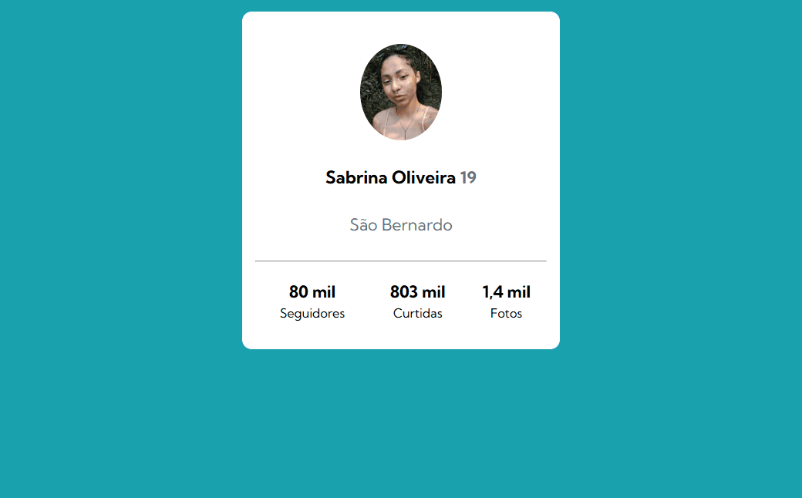

# Frontend Mentor | Profile card component

Exercício de HTML e CSS avançado 

## Tecnologias Utilizadas

- CSS
- HTML

## Descrição

Nesse exercício pratiquei o uso do flexbox para posicionar pois o `flexbox` facilita a criação de uma estrutura de layout sem precisar  usar o `float` ou posicionamento. Ele visa proporcionar uma forma melhor e mais eficiente de nos alinharmos e distribuirmos espaços entre elementos dentro de um container, mesmo quando o tamanho dos elementos é desconhecido ou dinâmico, daí vem o nome flex. O `flexbox` **é mais indicado para layouts de pequena escala e componentes de um site.**

[]

## Aprendizados e Dificuldades

Nesse exercício, coloquei em pratica meus conhecimentos utilizando o flexbox para estilizar o site. Houve dificuldades no processo, princpalmente com o enquadramento do card mas aprendi com cada erro!# profile-card 
